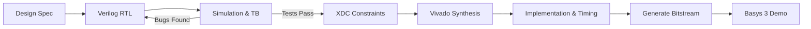

# Digital System Design — FPGA Lab Sessions

UCF · College of Engineering & Computer Science · Department of ECE

Welcome to the **FPGA Laboratory Sessions for Digital System Design**. This course provides hands-on experience in RTL design using synthesizable **Verilog HDL**, simulation testbenches, and hardware implementation on the **Digilent Basys 3 FPGA** (AMD/Xilinx Artix-7) using **AMD Vivado ML**.

---

  

    
5

    
Laboratory Sessions

    
From Gates to Serial I/O

  

  

    
1

    
Capstone Project

    
Team Digital System Design

  

  

    
Artix-7

    
FPGA Target

    
XC7A35T-1CPG236C

  

  

    
Vivado

    
EDA Toolchain

    
Synthesis · P&R · ILA

  

---

## Quick Navigation

  

    🚀
    <strong>Toolchain Setup</strong>
    
Install AMD Vivado ML Edition and configure cable drivers.

    <a class="md-button md-button--primary" href="getting-started/vivado-setup.md">Get Started →</a>
  

  

    🔌
    <strong>Basys 3 Board</strong>
    
Pinouts, clocking, switches, LEDs, and 7-segment display specs.

    <a class="md-button md-button--primary" href="getting-started/basys3-guide.md">Hardware Guide →</a>
  

  

    🧪
    <strong>Lab Sessions</strong>
    
Complete lab manuals for all 5 progressive FPGA labs.

    <a class="md-button md-button--primary" href="labs/index.md">View Labs →</a>
  

  

    🏆
    <strong>Capstone Project</strong>
    
System specifications, project scaffolds, and grading rubrics.

    <a class="md-button md-button--primary" href="project/index.md">Project Specs →</a>
  

---

## Laboratory Curriculum Arc

The laboratory sessions follow a progressive learning path from basic combinational logic gates to complex interactive digital systems.

  <a class="day-card" href="labs/lab1.md">
    
LAB 01

    
Combinational Logic & Vivado Workflow

    
HDL primitives, structural & behavioral modeling, testbenches, synthesis, and programming your first bitstream.

  </a>

  <a class="day-card" href="labs/lab2.md">
    
LAB 02

    
Sequential Logic & Clock Dividers

    
D Flip-Flops, synchronous registers, binary up/down counters, and dividing the 100 MHz oscillator to human-visible frequencies.

  </a>

  <a class="day-card" href="labs/lab3.md">
    
LAB 03

    
Finite State Machines & Debouncing

    
Mealy and Moore FSM state diagrams, push-button mechanical contact debouncing, and synchronous edge detection.

  </a>

  <a class="day-card" href="labs/lab4.md">
    
LAB 04

    
Memory & 7-Segment Displays

    
Distributed and Block RAM (BRAM), time-multiplexed 4-digit 7-segment LED display controller, and hex decoders.

  </a>

  <a class="day-card" href="labs/lab5.md">
    
LAB 05

    
UART Serial Communication

    
Asynchronous serial transmitter and receiver, baud rate generator, FIFO buffers, and PC-to-FPGA serial interaction.

  </a>

  <a class="day-card" href="project/index.md">
    
FINAL PROJECT

    
Capstone Digital System Design

    
Collaborative digital system implementation integrating FSMs, memory, peripherals, and external I/O on the Basys 3.

  </a>

---

## Standard Laboratory Workflow

Every lab follows an industry-standard digital IC design and FPGA verification pipeline:

> [!TIP]
> **Simulate Before You Synthesize!**
> Synthesis and Bitstream generation can take several minutes. Writing behavioral testbenches and verifying in Vivado Simulator (`xsim`) saves 80% of your lab debugging time.

---

## Resources & Helpful References

- [Basys 3 Master XDC Constraints](getting-started/xdc-master.md) — Copy and uncomment pins for switches, LEDs, 7-seg, and clock.
- [Synthesizable Verilog HDL Cheat Sheet](references/verilog-cheatsheet.md) — Quick reference for operators, always blocks, and FSM templates.
- [Vivado Simulation & Timing Tips](references/vivado-tips.md) — How to inspect waveforms, fix timing violations, and read synthesis logs.
- [Troubleshooting & Common Traps](references/troubleshooting.md) — How to solve inferred latches, multi-driven nets, and unassigned pins.
