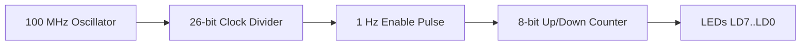

# Lab 2: Sequential Logic & Clock Dividers

<p class="subtitle">Digital System Design · Lab 02</p>

## Objectives
- Design and simulate edge-triggered synchronous sequential circuits (D Flip-Flops, Registers, and Binary Counters).
- Understand synchronous vs. asynchronous reset schemes in FPGA architectures.
- Implement an integer clock divider to reduce the 100 MHz crystal oscillator down to human-visible rates (1 Hz to 10 Hz).
- Cascade counters to drive on-board LEDs in multiple operating modes (increment, decrement, hold, clear).

---

## Background & Theory

The Basys 3 crystal oscillator oscillates at **$100\text{ MHz}$** ($T = 10\text{ ns}$). If a binary counter directly increments on every $100\text{ MHz}$ clock edge, human eyes cannot perceive LED transitions.

To generate a $1\text{ Hz}$ toggle signal:

$$\text{Count Limit} = \frac{f_{\text{in}}}{2 \times f_{\text{out}}} = \frac{100 \times 10^6}{2 \times 1} = 50,000,000$$

A 26-bit register ($2^{26} = 67,108,864 > 50,000,000$) is required to store this count.



---

## Verilog RTL Implementation

### 1. Parametric Clock Divider (`clk_divider.v`)
```verilog
module clk_divider #(
    parameter COUNT_MAX = 50_000_000 // Yields 1 Hz from 100 MHz clk
)(
    input  wire clk,
    input  wire rst,
    output reg  clk_out
);

    reg [31:0] count;

    always @(posedge clk or posedge rst) begin
        if (rst) begin
            count   <= 32'd0;
            clk_out <= 1'b0;
        end else if (count == COUNT_MAX - 1) begin
            count   <= 32'd0;
            clk_out <= ~clk_out;
        end else begin
            count   <= count + 1'b1;
        end
    end

endmodule
```

### 2. Multi-Function 8-bit Counter (`counter_8bit.v`)
```verilog
module counter_8bit (
    input  wire       clk,
    input  wire       rst,
    input  wire       en,
    input  wire       up_down, // 1: Count Up, 0: Count Down
    output reg  [7:0] count
);

    always @(posedge clk or posedge rst) begin
        if (rst) begin
            count <= 8'h00;
        end else if (en) begin
            if (up_down)
                count <= count + 1'b1;
            else
                count <= count - 1'b1;
        end
    end

endmodule
```

---

## Simulation & Testbench

```verilog
`timescale 1ns / 1ps

module tb_counter();
    reg clk, rst, en, up_down;
    wire [7:0] count;

    counter_8bit uut (
        .clk(clk), .rst(rst), .en(en), .up_down(up_down), .count(count)
    );

    // 100 MHz Clock Generator (10ns period)
    always #5 clk = ~clk;

    initial begin
        clk = 0; rst = 1; en = 0; up_down = 1;
        #20 rst = 0;
        
        #10 en = 1; // Count Up
        #100;
        
        up_down = 0; // Count Down
        #50;
        
        en = 0; // Pause
        #30;
        
        $finish;
    end
endmodule
```

---

## Checkoff Rubric

| Item | Points | Description |
| :--- | :---: | :--- |
| **Clock Divider Calculation** | 20 | Correct bitwidth and counter limit derivation |
| **RTL Code Quality** | 30 | Clean non-blocking `<=` assignments, no inferred latches |
| **Hardware Demo** | 50 | Smooth 1 Hz LED counting; up/down switch and pause button work as specified |
| **Total** | **100** | |
