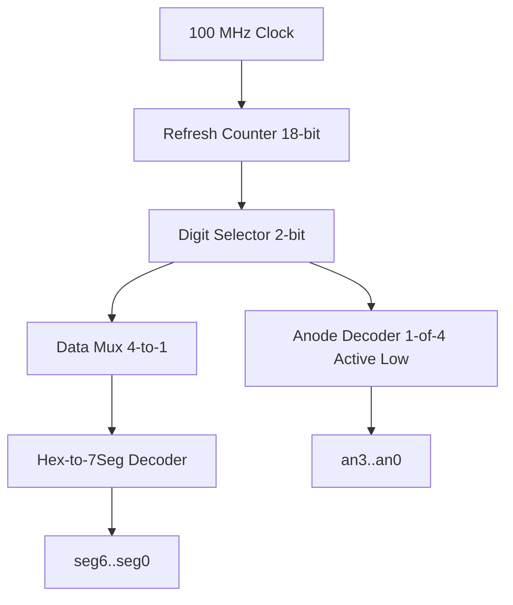

# Lab 4: Memory & 7-Segment Displays

<p class="subtitle">Digital System Design · Lab 04</p>

## Objectives
- Understand FPGA internal memory architectures: **Distributed RAM** (LUT RAM) vs. **Block RAM** (dedicated 36Kb dual-port BRAM blocks).
- Implement a synthesizable single-port and dual-port synchronous RAM in Verilog HDL.
- Design a time-multiplexed 4-digit 7-segment LED display controller with active-low common anodes and active-low cathodes.
- Create an interactive memory-inspection tool: write data via switches and display read data in hexadecimal across the 4-digit display.

---

## 4-Digit 7-Segment Multiplexing Architecture

All four 7-segment digits on the Basys 3 share the **exact same 7 cathode lines** (`CA` through `CG`). To display four distinct numbers simultaneously, we rapidly cycle through the four digits one by one (**time-division multiplexing**).



At a refresh counter toggle frequency of **$1\text{ kHz}$**, each digit is illuminated for $1\text{ ms}$ ($250\text{ Hz}$ per digit), eliminating any visual flicker due to **persistence of vision**.

---

## Verilog RTL Modules

### 1. Hexadecimal to 7-Segment Decoder (`hex_to_7seg.v`)
```verilog
module hex_to_7seg (
    input  wire [3:0] hex,
    output reg  [6:0] seg // seg[0]=CA, seg[1]=CB, ..., seg[6]=CG (Active LOW)
);

    always @(*) begin
        case (hex)
            4'h0: seg = 7'b1000000; // 0
            4'h1: seg = 7'b1111001; // 1
            4'h2: seg = 7'b0100100; // 2
            4'h3: seg = 7'b0110000; // 3
            4'h4: seg = 7'b0011001; // 4
            4'h5: seg = 7'b0010010; // 5
            4'h6: seg = 7'b0000010; // 6
            4'h7: seg = 7'b1111000; // 7
            4'h8: seg = 7'b0000000; // 8
            4'h9: seg = 7'b0010000; // 9
            4'hA: seg = 7'b0001000; // A
            4'hB: seg = 7'b0000011; // b
            4'hC: seg = 7'b1000110; // C
            4'hD: seg = 7'b0100001; // d
            4'hE: seg = 7'b0000110; // E
            4'hF: seg = 7'b0001110; // F
            default: seg = 7'b1111111; // Blank
        endcase
    end

endmodule
```

### 2. Time-Multiplexed 4-Digit Controller (`seven_seg_mux.v`)
```verilog
module seven_seg_mux (
    input  wire       clk,
    input  wire       rst,
    input  wire [3:0] val0, val1, val2, val3, // 4 Nibbles to display
    output reg  [3:0] an,                     // Active-low anodes
    output wire [6:0] seg                     // Active-low cathodes
);

    reg [17:0] refresh_counter;
    wire [1:0] active_digit = refresh_counter[17:16];
    reg [3:0] current_nibble;

    always @(posedge clk or posedge rst) begin
        if (rst)
            refresh_counter <= 0;
        else
            refresh_counter <= refresh_counter + 1'b1;
    end

    // Anode activation and data multiplexing
    always @(*) begin
        case (active_digit)
            2'b00: begin an = 4'b1110; current_nibble = val0; end
            2'b01: begin an = 4'b1101; current_nibble = val1; end
            2'b10: begin an = 4'b1011; current_nibble = val2; end
            2'b11: begin an = 4'b0111; current_nibble = val3; end
        endcase
    end

    hex_to_7seg u_dec (.hex(current_nibble), .seg(seg));

endmodule
```

---

## Checkoff Rubric

| Item | Points | Description |
| :--- | :---: | :--- |
| **Multiplexing Timing Derivation** | 20 | Justify refresh counter bit selection for flicker-free display |
| **BRAM / RAM Synthesis Log** | 30 | Verify that memory infers Block RAM without timing violations |
| **Hardware Demo** | 50 | Stable 4-digit hexadecimal display showing read/write memory data |
| **Total** | **100** | |
