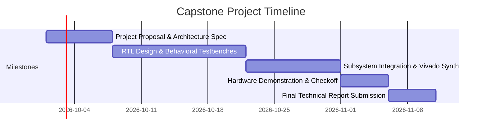

# Final Capstone Project

Digital System Design · Capstone Design Experience

## Overview
The Capstone Project is a culminating team design experience where you will architect, simulate, synthesize, and demonstrate an interactive digital system on the **Digilent Basys 3 FPGA**.

The project integrates concepts from all five laboratory sessions:
- **Hierarchical Modular Design** with clean signal interfaces.
- **Complex Finite State Machines** for system control flow.
- **Clock Management & Timing Closure** on the 100 MHz clock domain.
- **Memory & Storage** using registers, FIFOs, or Block RAM.
- **Peripheral Interfacing** (7-Segment displays, buttons, switches, LEDs, UART, or VGA).

---

## Project Team Structure
- **Team Size**: 2 to 3 students per team.
- **Roles & Responsibilities**: Each member must lead a major architectural subsystem (e.g., Datapath & Memory, Control FSM, or Peripheral I/O & Verification).

---

## Timeline & Milestones

| Milestone | Deliverable | Weight |
| :--- | :--- | :---: |
| **Milestone 1** | Architectural Proposal & Block Diagram | 10% |
| **Milestone 2** | Subsystem Simulation Waveforms & RTL Skeleton | 20% |
| **Milestone 3** | Full System Integration & Bitstream Generation | 20% |
| **Milestone 4** | Live Hardware Demonstration to Course Staff | 30% |
| **Milestone 5** | Final IEEE-format Technical Report & Code Repository | 20% |

---

## Getting Started

1. Browse the [Approved Project Scaffolds](project-ideas.md) or propose a custom project.
2. Review the [Project Evaluation Rubric](rubric.md) to ensure your design satisfies all technical requirements.
